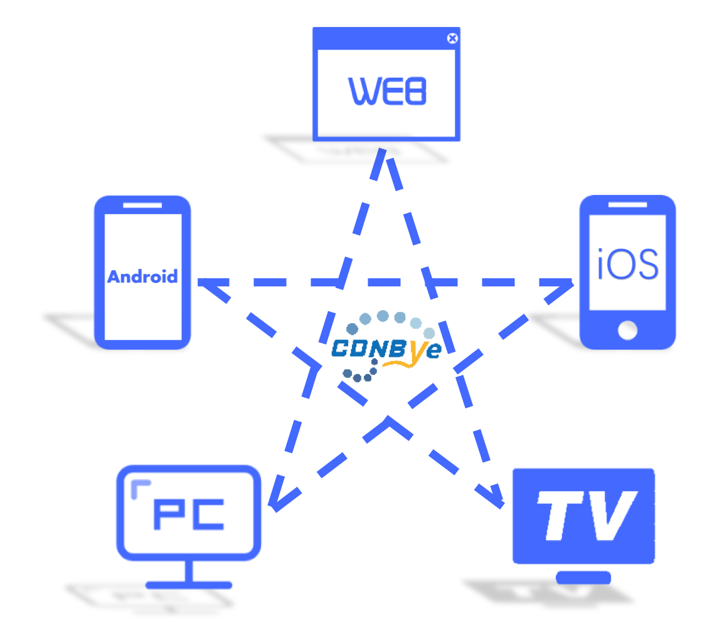
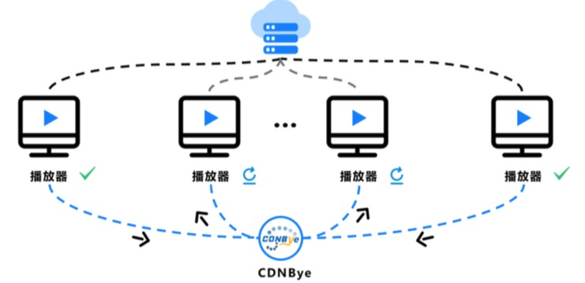

### CDNBye跨平台流媒体加速引擎 :id=head
> 基于WebRTC Datachannel标准协议，无缝打通Web、iOS、Android与PC，实现全平台流媒体加速，与高昂的CDN流量费Say Goodbye!

### 面向未来的P2P流媒体技术
随着5G技术的普及，包括直播在内的在线视频娱乐已经逐渐成为主流娱乐方式。然而，CDN部署成本极高，成本增速超过收入增速，落后的技术无法满足各大视频厂商扩张业务和降低成本的需求。对于终端用户而言，由于多数CDN服务商不能覆盖全部ISP和网络边缘，导致用户在观看视频时都无法避免地遭受二次缓冲、卡顿等不良体验。
"P2P+CDN"的视频传输模型有效的解决了服务器带宽不足的问题，在提升用户观看体验的同时为视频厂商节省带宽成本。
然而，传统的P2P技术由于自身的局限性（大多采用私有协议），无法实现跨平台的端到端传输，这极大的限制了P2P的利用率。CDNBye采用WebRTC Datachannel标准协议，实现了Web、iOS、Android与PC的全平台P2P互联，充分利用网络中每个节点的上行带宽，解决了P2P无法跨平台以及利用率不高的痛点。

### 先进的P2P+CDN架构
CDN与P2P在流媒体分发中存在非常强的互补性，CDNBye的P2P分发网络与CDN技术深度融合，视频观看者首次点开播放器一律到CDN边缘节点获取资源，在已经能够正常观看视频的过程中同时连入P2P网络，在保证足够剩余缓冲时间的前提下从对等端获取资源。一旦对等端下线或者网络抖动，再无缝切换回CDN边缘节点取片，保证视频的流畅播放，从而解决了P2P网络可用性不可控的问题。

### 消除P2P安全隐患
CDNBye基于WebRTC技术进行P2P传输，主流浏览器默认支持WebRTC，用户使用完全无感知，不需要安装额外的插件，解决了传统P2P安装插件或者客户端软件带来的繁琐和安全隐患。对于视频提供商来说，WebRTC原生的安全传输特性加上本产品支持加密HLS的P2P传输，使得原有的DRM方案完全不受影响，让视频方没有被盗链的风险。

### 后台管理系统
在接入P2P插件后，访问`https://oms.cdnbye.com`，注册并绑定域名，即可查看该域名的P2P流量、在线人数、用户地理分布等信息。

### 客户案例

### 联系我们
邮箱：service@cdnbye.com

### 技术支持
QQ群：746163014

### Github Star数趋势图

      
**快速开始 👉[Web](/web/introduction.md)   👉[iOS](/ios/introduction.md)   👉[安卓](/android/introduction.md)** 
