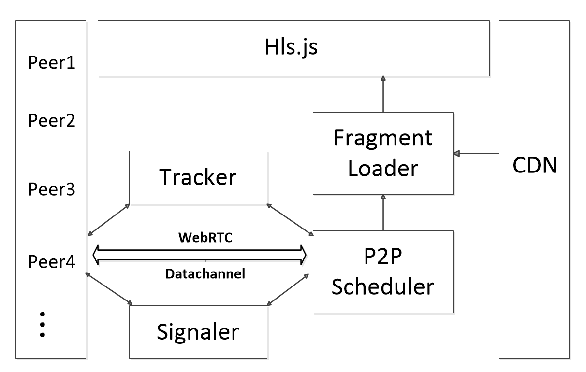
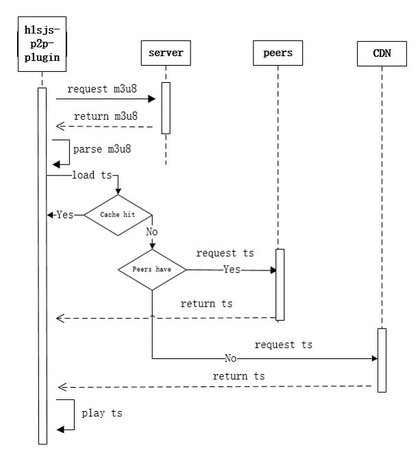

## 设计理念
- 采用仿BT算法，简化BT的流程，并且针对流媒体的特点对算法进行调整
- 不改动hls.js源码，并且可以与其无缝衔接，几行代码集成，便于在现有项目中快速集成
- 高可配置化，用户可以根据特定的使用环境调整各个参数
- 支持video.js、Clappr、Flowplayer等第三方播放器
- 通过有效的调度策略来保证用户的播放体验以及p2p率
- Tracker服务器根据访问IP的ISP、地域等进行智能调度

## 整体架构

## Fragment Loader调度过程

## P2P分享过程

  